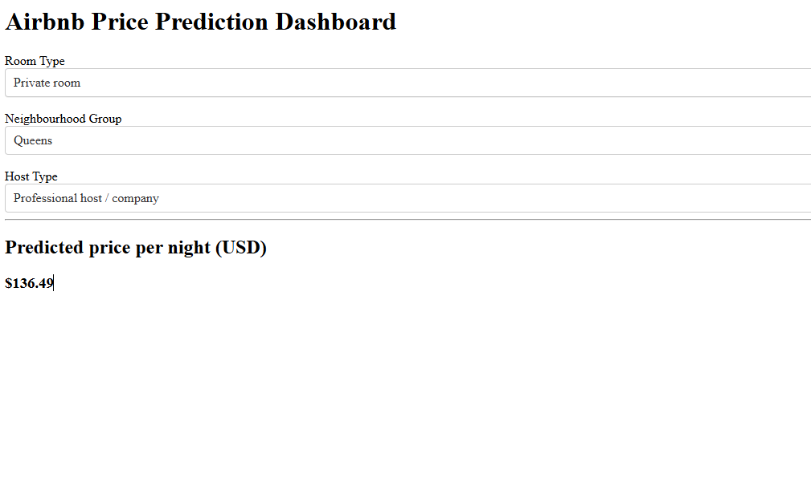

## Dashboard Preview

# Airbnb Price Prediction (NYC)

## Overview
This project predicts Airbnb listing prices in New York City using a machine learning model trained on the AB_NYC_2019 dataset.

## Model
- XGBoost regression
- Target variable: price

## Dashboard
An interactive Dash web application predicts **price per night (USD)** based on:
- Room type
- Neighbourhood group
- Host type (individual vs professional)

## How to Run
pip install -r requirements.txt
python Models/App.py
